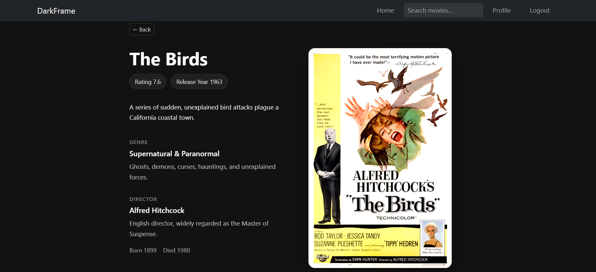
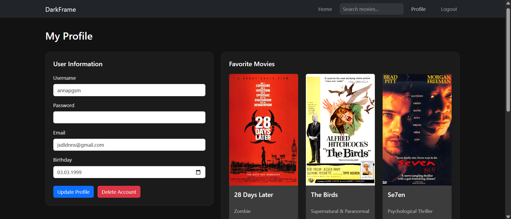
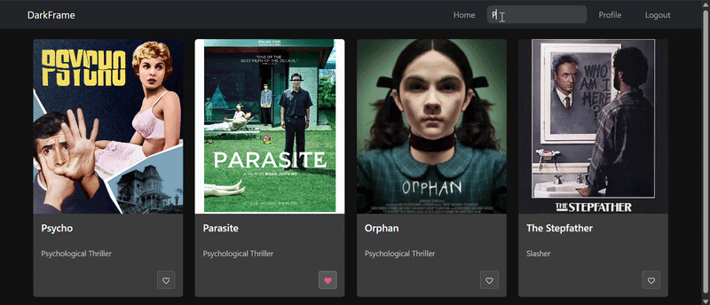

# DarkFrame (React Client)

DarkFrame is a React-based movie discovery app built on top of a custom REST API (DarkFrame Movie API). It features real-time search, user authentication, protected routes, and personalized favorite lists for horror and thriller movies.

The project focuses on creating a clean, product-like experience while demonstrating full-stack integration with a RESTful API, including authentication and persistent user data.

## Live Demo
The application is deployed on Netlify:

https://darkframe.netlify.app/

## Preview


### Movie Details


### Profile


### Search



## Key Features
- Browse and search movies in real time
- View detailed movie information (genre, director, description)
- Register and log in as a user
- Add and remove favorites
- Persistent user data (saved in database)
- User profile management
- Responsive design

## Tech Stack  

### Frontend
- React
- React Router

### Styling
- Bootstrap

### Tooling & Deployment
- Parcel
- Netlify

### Backend (separate repository)
- Node.js
- Express
- MongoDB
- JWT Authentication


- 🔗 Backend Repository: https://github.com/annapgsm/darkframe-api
- 🌐 API Base URL: https://movie-api-o14j.onrender.com/

## Architecture Highlights

- Built as a single-page application using React
- Handles client-side routing with React Router
- Integrates with a RESTful API for all data operations
- Manages authentication state using JWT tokens stored on the client
- Structured with reusable components and clear separation of concerns


## Set up instructions

### Prerequisites
- Node.js and npm installed
- Running instance of the MyFlix API 

### Steps
1. **Clone the repository**  
   ```bash
   git clone https://github.com/annapgsm/darkframe-client.git
   cd darkframe-client
2. **Install dependencies** 
   ```bash
   npm install
3. **Environment  variables**
-  Create a .env file in the root of the project and add:
  ```bash
REACT_APP_API_URL=https://movie-api-o14j.onrender.com/
 ```

- The React app uses this environment variable to make API requests. Make sure your API calls reference `process.env.REACT_APP_API_URL`.

4. **Run locally**
 ```bash
   parcel src/index.html 

```

## Learnings
- Implemented client-side routing and protected views based on authentication
- Integrated a frontend application with a RESTful backend API
- Managed authentication state using JWT tokens
- Learned how to structure a scalable React application with reusable components


